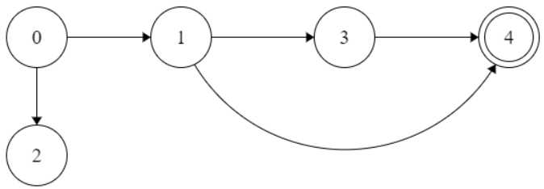

# Course Schedule

Author: [Andrew Gyakobo](https://github.com/Gyakobo)

## Introduction

The is a simple solution to the infamous "course scheduling problem" using a topological sort. Fun fact, my professor actually got an internship at Google by correctly solving this problem during his interview - that lucky devil.

## Methodolgy

* Let's consider the following `prerequisites = [ [0, 1], [0, 2], [1, 3], [1, 4], [3, 4] ]` and `numCourses = 5`

* We can therefore make a dependency graph looking at all this prerequisites:



In the code we can create the said graph this way:
```python
class Solution:
    def course_schedule(self, numCourses, prerequisites):
        # Create a dependency graph
        preMap = {int:list}

        preMap = { i:[] for i in range(numCourses) }
        for course, pre in prerequisites:
            preMap[crs].append(pre)

        '''
        0: [1, 2] 
        1: [3, 4] 
        2: [] 
        3: [4] 
        4: [] 
        '''
```

* We can then just run a *postorder* DFS traversal approach to this graph and basically map out a path. 

>[!IMPORTANT]
>If the path happens to come across its own tail, ie. the graph happens to have a cycle, then DFS traversal shall be immediately halted and return a `False` 

```python
visited = set()
def dfs(crs):
    if crs in visited:
        return False
    if preMap[crs] == []:
        return True

    visited.add(crs)
    for pre in preMap[crs]:
        if not dfs(pre): return False
    visited.remove(crs)
    preMap[crs] = []
    return True

for crs in range(numCourses):
    if not dfs(crs): return False
return True
```

## License
MIT
